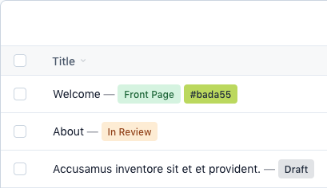
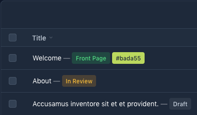

# Filament Badgeable Column 

[](https://packagist.org/packages/awcodes/filament-badgeable-column)
[](https://github.com/awcodes/filament-badgeable-column/actions?query=workflow%3A"Check+%26+fix+styling"+branch%3Amain)
[](https://packagist.org/packages/awcodes/filament-badgeable-column)

With Filament Badgeable Column you append badges to your columns.





## Installation

You can install the package via composer:

```bash
composer require awcodes/filament-badgeable-column
```

Optionally, you can publish the views, translations and assets using

```bash
php artisan vendor:publish --tag="filament-badgeable-column-views"
php artisan vendor:publish --tag="filament-badgeable-column-translations"
php artisan vendor:publish --tag="filament-badgeable-column-assets"
```

## Usage

`BadgeableColumn` extends Filament's own `TextColumn` so it supports all 
methods used by `TextColumn`.

```php
use Awcodes\FilamentBadgeableColumn\Components\Badge;
use Awcodes\FilamentBadgeableColumn\Components\BadgeField;
use Awcodes\FilamentBadgeableColumn\Components\BadgeableColumn;

return $table
    ->columns([
        BadgeableColumn::make('title')
            ->badges([
                Badge::make('front_page')
                    ->label('Front Page')
                    ->color('success')
                    ->visible(fn ($record): bool => $record->front_page),
                Badge::make('front_page_custom_color')
                    ->label('#bada55')
                    ->color('#bada55')
                    ->visible(fn ($record): bool => $record->front_page),
                Badge::make('trashed')
                    ->label('Trashed')
                    ->color('danger')
                    ->visible(fn ($record): bool => $record->deleted_at ?? false),
                BadgeField::make('status')
                    ->options([
                        'Draft' => 'Draft',
                        'Review' => 'In Review',
                        'Published' => 'Published'
                    ])
                    ->colors([
                        'gray' => 'Draft',
                        'warning' => 'Review',
                        'success' => 'Published',
                    ])
                    ->visible(fn ($record): bool => $record->status !== Status::Published->name)
            ])
            ->searchable()
            ->sortable(),
    ]);
```

## Testing

```bash
composer test
```

## Changelog

Please see [CHANGELOG](CHANGELOG.md) for more information on what has changed recently.

## Contributing

Please see [CONTRIBUTING](.github/CONTRIBUTING.md) for details.

## Security Vulnerabilities

Please review [our security policy](../../security/policy) on how to report security vulnerabilities.

## Credits

- [awcodes](https://github.com/awcodes)
- [All Contributors](../../contributors)

## License

The MIT License (MIT). Please see [License File](LICENSE.md) for more information.
